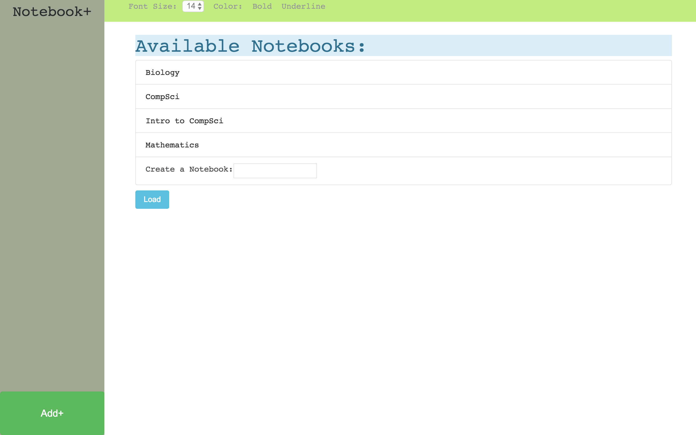

# Notebook+
Notebook+ - A lightweight note taking application, made using Electron JS.



# Features
Notebook+ can easily store your notes in file systems called "Notebooks"
Notebooks are designed to be easily to access and simple to use. Inside of each one
notes are ordered by their date of creation and can be customized & saved. This application
was created to act as a virtual notebook for anyone. This application was very
fun to develop and I hope you enjoy it as much as I do!

# Installation

Requirements:
- node js 7+

First, navigate to the application folder and install dependencies:
 ```bash
cd Notebook-
npm install
 ```

Then run the application and your set!
 ```bash
npm start
 ```

Enjoy!

# Disclaimer
Development is still underway so please
forgive and report any issues you may encounter.
